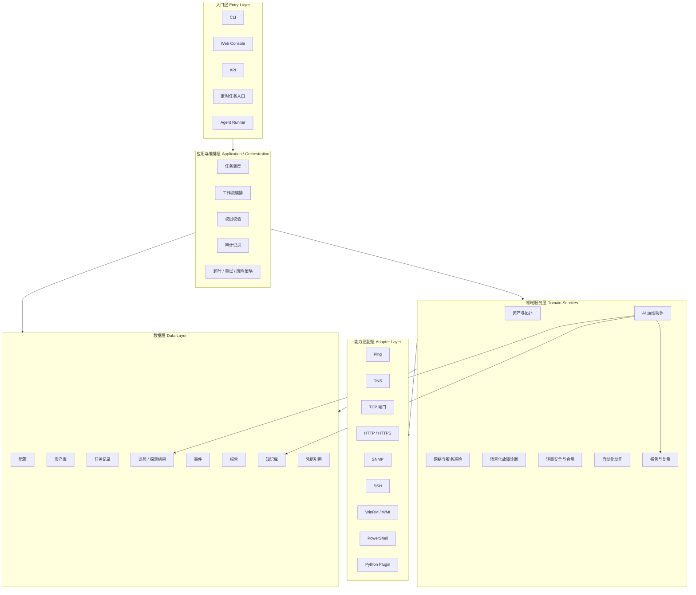
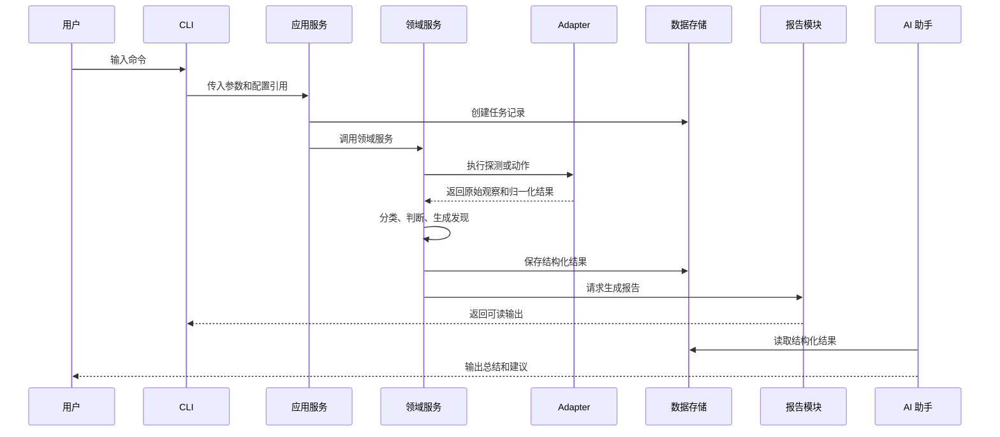
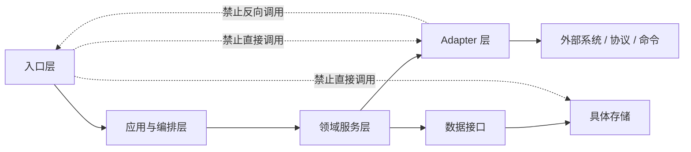

# 总开发与架构文档

## 文档状态

第一版详细草案，创建于 2026-06-08。

本文档是 `IT Ops Toolkit Platform` 的总开发文档。它用于回答三个问题：

1. 这个平台到底要做什么。
2. 第一阶段应该做什么，不应该做什么。
3. 后续扩展到 Web、AI、Agent 时，为什么不会推翻重来。

## 设计依据

本项目不是从想象中的“大平台”开始，而是从中小企业 IT 运维的真实约束出发。

公开资料中反复出现的基础方向包括：

- 资产识别、保护、检测、响应、恢复是基础能力。参考 [NIST Cybersecurity Framework 2.0 Small Business Quick Start Guide](https://www.nist.gov/itl/smallbusinesscyber/nist-cybersecurity-framework-0)。
- 小企业需要设备和软件清单、更新、备份、账号保护等基础工作。参考 [FTC Cybersecurity for Small Business](https://www.ftc.gov/tips-advice/business-center/small-businesses/cybersecurity)。
- CISA 面向小企业资源强调 MFA、备份、系统更新和事件响应准备。参考 [CISA Small Business Cybersecurity Resources](https://www.cisa.gov/resources-tools/resources/small-business-cybersecurity-resources)。
- CIS Controls v8.1 将资产清单、软件清单、数据恢复、访问控制、日志和网络监控列为关键控制项。参考 [CIS Critical Security Controls](https://www.cisecurity.org/controls)。
- IT 团队现实问题包括工具过多、可见性不足、重复手工任务多。参考 [Auvik 2025 IT Trends Report](https://www.auvik.com/franklyit/blog/2025-it-trends-report/) 和 [ITPro 2025 网络可见性报道](https://www.itpro.com/infrastructure/network-internet/it-professionals-report-critical-challenges-with-network-visibility)。
- AI 和 Agent 必须有风险管理。参考 [NIST AI Risk Management Framework](https://www.nist.gov/itl/ai-risk-management-framework) 和 [OWASP Top 10 for LLM Applications](https://owasp.org/www-project-top-10-for-large-language-model-applications/)。

详细调研记录见 [调研依据](research/2026-06-08-smb-it-ops-research.md)。

## 总目标

构建一个面向中小企业的模块化 IT 运维平台，帮助用户完成：

- 资产发现和基础拓扑整理。
- 网络与服务健康巡检。
- 常见故障场景诊断。
- 轻量安全和合规检查。
- 常见动作自动化。
- 报告输出和故障复盘。
- AI 辅助总结、解释和建议。
- 未来受控 Agent 执行。

## 第一阶段目标

第一阶段目标是做出一个可用的 CLI 运维工具箱，同时打好平台基础。

第一阶段必须形成完整链路：

```text
配置 -> CLI 命令 -> Adapter 探测 -> 领域服务处理 -> 结构化结果 -> 报告输出
```

这个链路的价值是：

- CLI 能马上用于实际工作。
- 结构化结果能被 Web、AI、报告和审计复用。
- Adapter 让后续接 SNMP、SSH、WinRM、WMI、PowerShell、Python 插件时不用重写领域逻辑。
- 领域服务不依赖 CLI，所以未来 Web 可以复用。

## 第一阶段不做什么

为了避免一开始失控，第一阶段明确不做：

- 完整 Web Console。
- 多用户登录和复杂 RBAC。
- 多租户 SaaS。
- 重型 CMDB。
- 完整 SIEM、EDR 或漏洞扫描平台。
- 复杂 SNMP 拓扑发现。
- 大规模 SSH/WinRM 批量运维。
- 无审批的自动修复 Agent。

这些不是永远不做，而是等基础能力稳定后再做。

## 核心架构原则

### 平台优先，CLI 优先

平台优先是架构原则：模块边界、数据模型、Adapter、任务记录、报告输出从第一天就设计好。

CLI 优先是交付原则：第一阶段先做一个实际可跑的命令行工具，而不是先堆 Web 页面。

这两个原则不冲突。CLI 只是入口层，真正的能力在领域服务层。

### 高内聚，低耦合

每个模块只做自己的事。

例如：

- 资产模块负责发现和记录资产，不负责告警。
- 巡检模块负责检查网络和服务状态，不负责生成 AI 总结。
- 报告模块负责把结构化结果转成可读内容，不负责执行探测。
- AI 模块负责解释和建议，不直接偷偷执行命令。

### 所有外部能力通过 Adapter 接入

Ping、DNS、TCP、HTTP、SNMP、SSH、WinRM、WMI、PowerShell、Python 脚本都属于外部能力。它们不能散落在业务代码里，而要封装成 Adapter。

Adapter 的职责：

- 接收标准输入。
- 调用外部协议、命令或脚本。
- 捕获错误。
- 归一化输出。
- 返回结构化结果。

### 结构化结果优先

不要让系统依赖“命令行输出文本”作为长期数据。

每次探测、扫描、巡检和诊断都应该产生结构化结果，至少包含：

- 目标。
- 时间。
- 执行方式。
- 状态。
- 原始观察值。
- 归一化判断。
- 错误信息。
- 证据。
- 风险等级或健康等级。

结构化结果可以被 CLI、Web、AI、报告、通知、审计同时使用。

## 总体分层架构



## 各层说明

### 入口层

入口层负责接收用户或系统请求。

包括：

- CLI。
- Web Console。
- API。
- 定时任务入口。
- Agent Runner。

入口层只负责参数解析、展示和交互，不承载核心业务逻辑。

错误示例：

```text
CLI 命令里直接写 ping、端口扫描、诊断判断、报告生成。
```

正确方向：

```text
CLI -> 应用服务 -> 领域服务 -> Adapter -> 结构化结果 -> 报告
```

### 应用与编排层

应用与编排层负责“怎么组织一次执行”。

包括：

- 创建任务。
- 调用领域服务。
- 处理超时。
- 处理失败重试。
- 做权限检查。
- 记录审计。
- 触发报告或通知。

它不负责判断“某个端口风险多大”，这种判断属于领域服务。

### 领域服务层

领域服务层是平台的业务核心。

主要模块：

- 资产与拓扑。
- 网络与服务巡检。
- 场景化故障诊断。
- 轻量安全与合规。
- 自动化动作。
- 报告与复盘。
- AI 运维助手。

领域服务应该尽量依赖接口，不依赖具体 CLI、Web、数据库或外部命令。

### 能力适配层

能力适配层负责把外部协议和工具变成内部可理解的数据。

例如：

- Ping Adapter 返回延迟、丢包、是否可达。
- DNS Adapter 返回解析结果、耗时、失败原因。
- TCP Adapter 返回端口是否开放、连接耗时。
- HTTP Adapter 返回状态码、响应时间、证书信息。
- PowerShell Adapter 运行 Windows 本机信息采集。
- SSH Adapter 未来用于网络设备或 Linux 服务器。

### 数据层

数据层负责保存长期可复用信息。

包括：

- 配置。
- 资产。
- 任务记录。
- 探测结果。
- 事件。
- 报告。
- 知识库。
- 凭据引用。

第一阶段可以使用本地文件或轻量数据库，但接口要设计成以后可替换。

## 核心业务模块

### 资产与拓扑

目标：知道环境里有什么。

能力包括：

- 网段扫描。
- IP 使用状态。
- 主机名识别。
- MAC 和厂商识别。
- 开放端口摘要。
- 新设备发现。
- 设备消失发现。
- 基础拓扑提示。

第一阶段只做基础资产发现，不做复杂拓扑推断。

### 网络与服务巡检

目标：知道关键网络和服务是否正常。

能力包括：

- 网关连通性。
- DNS 解析。
- TCP 端口可达性。
- HTTP 状态。
- 延迟和超时。
- 关键服务检查。
- 巡检报告。

第一阶段应支持用户配置一组目标，然后批量检查并输出报告。

### 场景化故障诊断

目标：把“用户现象”变成排查流程。

典型场景：

- 上不了网。
- 内网系统打不开。
- 远程桌面连不上。
- DNS 异常。
- 网络很慢。
- 打印机不可达。

诊断模块不自己实现所有探测，而是调用巡检、资产、DNS、TCP、HTTP、本机信息等能力。

### 轻量安全与合规

目标：发现中小企业常见的明显风险。

能力包括：

- 高风险端口暴露。
- 未知设备接入。
- 新开放端口。
- 证书过期。
- 本机防火墙和杀软状态。
- 基础补丁状态。
- 备份和恢复准备检查。

它不是完整安全产品，但要覆盖日常最容易忽略的问题。

### 自动化动作

目标：把常见动作标准化。

动作分级：

- 只读：检查、扫描、导出。
- 低风险变更：清 DNS 缓存、生成诊断包、刷新本地状态。
- 高风险变更：重启服务、修改配置、封禁设备、批量远程操作。

第一阶段优先只读和低风险动作。

### 报告与复盘

目标：把结构化结果变成可读内容。

报告类型：

- CLI 输出。
- Markdown 报告。
- HTML 报告。
- CSV 导出。
- 巡检日报。
- 周报。
- 故障复盘。

报告模块不负责执行检查，只负责消费结果。

### AI 运维助手

目标：让 AI 做解释、总结、建议和写作。

第一阶段可以先规划输入输出，不急着实现。

适合 AI 的工作：

- 总结巡检报告。
- 解释异常结果。
- 根据证据生成排查建议。
- 把故障过程整理成复盘。
- 把技术报告改写成领导可读版本。

不适合 AI 默认做的事：

- 直接修改网络设备配置。
- 直接执行批量删除、重启、封禁。
- 绕过审批执行高风险动作。

### Agent Runner

目标：未来让 Agent 执行已批准的工作流。

必须具备：

- 工作流定义。
- 风险等级。
- 权限校验。
- 审批点。
- 执行日志。
- 停止条件。
- 人工接管。

Agent 是长期方向，不是第一阶段实现重点。

## 平台支撑模块

### 配置中心

负责：

- 网段。
- 目标。
- 扫描配置。
- 巡检配置。
- 报告配置。
- Adapter 配置。
- 通知配置。

配置中心要避免到处散落硬编码。

### 任务调度中心

负责：

- 一次性任务。
- 定时任务。
- 任务状态。
- 超时和重试。
- 任务历史。
- 执行结果关联。

第一阶段可以先记录手动任务，后续再做定时执行。

### 数据存储

负责保存：

- 资产记录。
- 任务记录。
- 探测结果。
- 巡检结果。
- 安全发现。
- 报告。
- 事件。

### 插件与探针系统

负责扩展能力。

未来可以接入：

- 新 Probe。
- Python 脚本。
- PowerShell 脚本。
- SNMP 设备适配器。
- SSH 设备适配器。
- 厂商特定网络设备检查。

### 通知中心

未来支持：

- 邮件。
- 企业微信。
- 钉钉。
- 飞书。
- Webhook。

通知中心不判断问题，只负责发送。

### 权限与审计

负责：

- 谁执行了什么。
- 什么时候执行。
- 对哪个目标执行。
- 是否成功。
- 风险等级是什么。
- 是否经过审批。

第一阶段即使没有多用户，也应该保留审计结构。

### 凭据与密钥管理

负责防止密码、Token、密钥散落在脚本和日志里。

第一阶段至少要做到：

- 配置文件不直接鼓励明文密码。
- 日志不输出敏感信息。
- 报告不泄露凭据。
- 预留凭据引用机制。

### 日志与观测性

负责平台自身可排查。

需要记录：

- 任务开始和结束。
- Adapter 错误。
- 超时原因。
- 外部命令失败。
- 报告生成失败。
- AI 调用失败。

## 数据流



## 模块依赖规则



具体规则：

- CLI 和 Web 不能直接调用 Ping、DNS、TCP、HTTP 等 Adapter。
- CLI 和 Web 不能直接写数据库。
- 领域服务不能把结果只写成文本。
- Adapter 不能包含业务判断。
- 报告模块不能执行探测。
- AI 模块不能替代确定性的业务规则。

## 初始核心数据模型

第一阶段至少需要这些数据对象。

### Target

表示一个待检查目标。

字段示例：

- `id`
- `type`：ip、hostname、url、subnet、service
- `value`
- `tags`
- `owner`
- `description`

### Asset

表示一个已发现资产。

字段示例：

- `id`
- `ip`
- `hostname`
- `mac`
- `vendor`
- `os_hint`
- `open_ports`
- `first_seen`
- `last_seen`
- `source`

### ProbeResult

表示一次探测结果。

字段示例：

- `id`
- `target`
- `probe_type`
- `status`
- `started_at`
- `ended_at`
- `duration_ms`
- `observations`
- `error`
- `evidence`

### TaskRun

表示一次任务执行。

字段示例：

- `id`
- `task_type`
- `requested_by`
- `status`
- `risk_level`
- `started_at`
- `ended_at`
- `targets`
- `result_refs`
- `log_refs`

### Finding

表示一个发现或判断。

字段示例：

- `id`
- `category`
- `severity`
- `title`
- `description`
- `evidence_refs`
- `recommendation`

### Report

表示一份报告。

字段示例：

- `id`
- `report_type`
- `title`
- `generated_at`
- `source_task`
- `format`
- `path`
- `summary`

## 第一阶段验收标准

第一阶段完成时，至少要能做到：

1. 用户能配置一个网段或目标列表。
2. 用户能通过 CLI 运行资产发现。
3. 用户能通过 CLI 运行基础巡检。
4. 系统能输出结构化结果。
5. 系统能生成一份可读报告。
6. Adapter 和领域服务分离。
7. CLI 没有承载核心业务逻辑。
8. 后续 Web 可以调用同一批服务。

## Web Console 规划

Web 不是第一阶段重点，但架构必须预留。

Web 第一版建议包含：

- 资产列表。
- 资产详情。
- 任务历史。
- 巡检结果。
- 报告查看。
- 配置查看。
- 手动触发任务。

Web 不应该重新实现扫描和巡检逻辑，而是调用已有应用服务。

## AI 与 Agent 规划

AI 分阶段进入：

1. 报告总结。
2. 日志解释。
3. 异常原因解释。
4. 排障建议。
5. SOP 匹配。
6. 工作流规划。
7. 审批后执行。

Agent 执行必须满足：

- 明确工作流。
- 明确输入。
- 明确风险等级。
- 可中断。
- 有审批点。
- 有审计记录。
- 不允许默认无限权限。

## 文档系统

为了防止项目失控，文档分为几类：

- 项目愿景：说明为什么做。
- 总开发与架构文档：说明怎么设计。
- 模块地图：说明模块边界。
- 路线图：说明什么时候做。
- 开发规则：说明不能怎么做。
- 模块文档：说明每个模块的职责、输入、输出、依赖、验收。
- ADR：记录重要架构决策。
- 术语表：统一语言。
- 调研依据：记录现实背景和外部依据。

后续开发任何模块，都应该先读总文档，再读模块文档，然后写具体实现计划。

第一阶段进入开发前，还需要阅读：

- [Phase 1 实施计划](plans/phase-1-cli-foundation.md)
- [数据模型设计](data-model.md)
- [配置文件设计](config-schema.md)
- [Probe 与 Adapter 接口设计](probe-adapter-interface.md)
- [CLI 命令设计](cli-command-design.md)
- [部署模型](deployment-model.md)
- [风险策略](risk-policy.md)
- [ADR 索引](adr/README.md)
