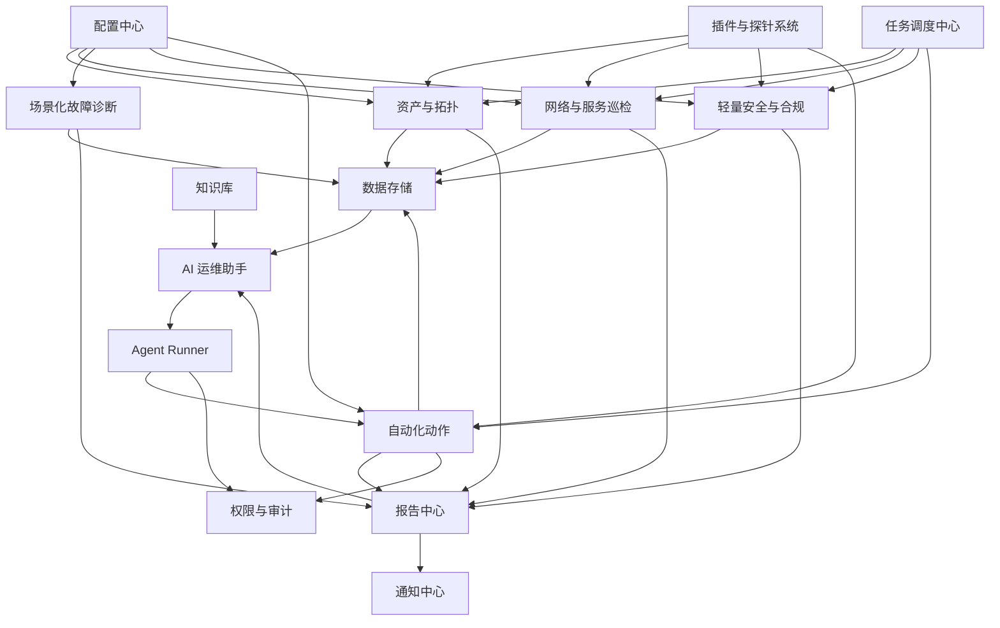

# 模块地图

## 文档目的

模块地图用于定义系统边界。它回答：

- 平台有哪些模块。
- 每个模块负责什么。
- 每个模块不负责什么。
- 模块之间如何依赖。
- 哪些模块第一阶段必须做。
- 哪些模块只是为未来预留。

没有模块地图，项目很容易变成一堆脚本：今天在 CLI 里写扫描，明天在报告里写诊断，后天在 AI Prompt 里写业务规则，最后谁也说不清哪段逻辑属于哪里。

## 总模块关系



## 核心业务模块

| 模块 | 主要职责 | 不负责 | 第一阶段优先级 |
|---|---|---|---|
| 资产与拓扑 | 发现资产、记录 IP/MAC/主机名/端口、识别新设备和消失设备。 | 告警、自动修复、权限管理。 | 高 |
| 网络与服务巡检 | 检查网关、DNS、TCP 端口、HTTP 服务、延迟和可用性。 | 资产归属、安全深度分析。 | 高 |
| 场景化故障诊断 | 把“上不了网”“系统打不开”等症状转成排查流程。 | 直接执行危险修复。 | 中 |
| 轻量安全与合规 | 发现高风险端口、未知设备、证书过期、基础安全状态异常。 | 完整 SIEM、EDR、漏洞利用。 | 中 |
| 自动化动作 | 标准化常见只读或低风险动作，记录执行结果。 | 无审批高风险变更。 | 中 |
| 报告中心 | 生成 CLI、Markdown、HTML、CSV、日报、周报、故障复盘。 | 自己执行探测或诊断。 | 高 |
| AI 运维助手 | 总结、解释、建议、生成报告草稿。 | 默认直接执行命令。 | 中 |
| Agent Runner | 未来执行受控工作流。 | 第一阶段实现、无限权限自动化。 | 低 |

## 平台支撑模块

| 模块 | 主要职责 | 第一阶段优先级 |
|---|---|---|
| 配置中心 | 管理网段、目标、巡检配置、扫描配置、Adapter 配置、报告配置。 | 高 |
| 任务调度中心 | 管理手动任务、未来定时任务、任务状态、超时、重试、历史。 | 中 |
| 数据存储 | 保存资产、任务、探测结果、事件、报告和知识库引用。 | 高 |
| 插件与探针系统 | 定义 Adapter 和 Probe 接口，支持后续扩展。 | 高 |
| 通知中心 | 未来对接邮件、企业微信、钉钉、飞书、Webhook。 | 低 |
| 权限与审计 | 记录操作、准备未来角色权限和审批。 | 中 |
| 凭据与密钥管理 | 管理凭据引用，防止密钥散落在脚本和日志中。 | 中 |
| 知识库 | 保存 SOP、故障案例、AI 参考资料。 | 低 |
| 日志与观测性 | 记录平台日志、任务日志、Adapter 错误和耗时。 | 中 |

## 第一阶段最小模块组合

第一阶段不要所有模块平均用力。最小组合建议是：

```text
配置中心
  -> CLI 入口
  -> 插件与探针系统
  -> 资产与拓扑
  -> 网络与服务巡检
  -> 数据存储
  -> 报告中心
```

这个组合能跑通最小闭环：

```text
配置目标 -> 运行命令 -> 执行探测 -> 保存结果 -> 生成报告
```

## 模块边界原则

### 资产与拓扑 vs 网络与服务巡检

资产模块关心“有什么”。

巡检模块关心“是否正常”。

例如：

- `192.168.1.10 是一台 Windows 主机` 属于资产模块。
- `192.168.1.10 的 3389 端口当前不可达` 属于巡检模块。

### 巡检 vs 诊断

巡检模块提供单项检查结果。

诊断模块把多个检查组合成排障结论。

例如：

- DNS 解析失败属于巡检结果。
- “用户上不了网，原因可能是 DNS 异常”属于诊断结果。

### 安全合规 vs 自动化动作

安全合规模块发现风险。

自动化模块执行动作。

例如：

- “某设备开放 445 端口”是安全发现。
- “关闭某防火墙规则”是自动化动作，且属于高风险操作，第一阶段不自动执行。

### AI vs 业务规则

AI 可以解释业务规则产生的结果，但不应该把关键判断藏在 Prompt 里。

例如：

- “3389 暴露到非可信网段属于高风险”应写在安全模块规则中。
- AI 可以解释为什么这是风险，并给出处理建议。

## 模块文档要求

每个模块文档必须包含：

- 模块职责。
- 现实场景。
- 不负责什么。
- 输入。
- 输出。
- 依赖模块。
- 被哪些模块调用。
- 第一阶段范围。
- 未来扩展。
- 风险点。
- 验收标准。

模块文档位于 `docs/modules/`。

