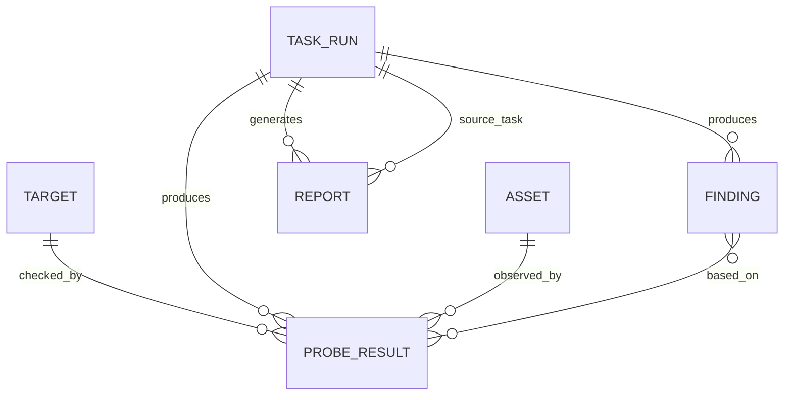

# 数据模型设计

## 文档目的

这份文档定义平台第一阶段的核心数据对象。

数据模型的目标是让 CLI、Web、报告、AI、审计都能复用同一批结构化结果，而不是各模块各自发明字段。

## 核心对象关系

## 通用字段规则

所有核心对象建议包含：

- `id`：唯一 ID。
- `created_at`：创建时间。
- `updated_at`：更新时间，可选。

时间建议使用 ISO 8601 格式。

## Target

Target 表示待检查目标。

字段：

| 字段 | 说明 |
|---|---|
| `id` | 目标 ID |
| `type` | `ip`、`hostname`、`url`、`subnet`、`service` |
| `value` | 目标值 |
| `name` | 可读名称 |
| `tags` | 标签 |
| `owner` | 负责人，可选 |
| `description` | 描述 |

## Asset

Asset 表示已发现资产。

字段：

| 字段 | 说明 |
|---|---|
| `id` | 资产 ID |
| `ip` | IP 地址 |
| `hostname` | 主机名 |
| `mac` | MAC 地址 |
| `vendor` | 厂商 |
| `os_hint` | 操作系统线索 |
| `asset_type` | 设备类型线索 |
| `open_ports` | 开放端口摘要 |
| `first_seen` | 首次发现时间 |
| `last_seen` | 最近发现时间 |
| `status` | `active`、`missing`、`unknown` |
| `source` | 发现来源 |

## ProbeResult

ProbeResult 表示一次探测结果。

字段：

| 字段 | 说明 |
|---|---|
| `id` | 探测结果 ID |
| `task_id` | 所属任务 |
| `target_id` | 目标 ID |
| `probe_type` | `ping`、`dns`、`tcp`、`http` |
| `status` | `success`、`failed`、`timeout`、`skipped` |
| `started_at` | 开始时间 |
| `ended_at` | 结束时间 |
| `duration_ms` | 耗时 |
| `observations` | 观察值 |
| `error` | 错误对象 |
| `evidence` | 证据 |

## TaskRun

TaskRun 表示一次任务执行。

字段：

| 字段 | 说明 |
|---|---|
| `id` | 任务 ID |
| `task_type` | `asset_scan`、`health_check`、`diagnosis`、`report_generate` |
| `requested_by` | 执行人或执行来源 |
| `source` | `cli`、`web`、`scheduler`、`agent` |
| `status` | `pending`、`running`、`success`、`failed`、`cancelled` |
| `risk_level` | `read_only`、`low_change`、`high_change` |
| `started_at` | 开始时间 |
| `ended_at` | 结束时间 |
| `target_refs` | 目标引用 |
| `result_refs` | 结果引用 |
| `log_refs` | 日志引用 |

## Finding

Finding 表示系统基于结果产生的发现。

字段：

| 字段 | 说明 |
|---|---|
| `id` | 发现 ID |
| `task_id` | 所属任务 |
| `category` | `availability`、`performance`、`security`、`configuration` |
| `severity` | `info`、`low`、`medium`、`high`、`critical` |
| `title` | 标题 |
| `description` | 描述 |
| `evidence_refs` | 证据引用 |
| `recommendation` | 建议 |
| `requires_human_review` | 是否需要人工确认 |

## Report

Report 表示一份报告。

字段：

| 字段 | 说明 |
|---|---|
| `id` | 报告 ID |
| `source_task_id` | 来源任务 |
| `report_type` | `asset`、`health`、`diagnosis`、`security` |
| `title` | 标题 |
| `format` | `cli`、`markdown`、`html`、`csv`、`json` |
| `path` | 文件路径 |
| `summary` | 摘要 |
| `generated_at` | 生成时间 |

## Error 对象

统一错误对象建议包含：

| 字段 | 说明 |
|---|---|
| `code` | 错误代码 |
| `message` | 可读错误 |
| `detail` | 详细信息 |
| `retryable` | 是否可重试 |
| `raw` | 原始错误，可选，注意脱敏 |

## 状态枚举

### ProbeResult.status

- `success`
- `failed`
- `timeout`
- `skipped`

### TaskRun.status

- `pending`
- `running`
- `success`
- `failed`
- `cancelled`

### Finding.severity

- `info`
- `low`
- `medium`
- `high`
- `critical`

### risk_level

- `read_only`
- `low_change`
- `high_change`

## 第一阶段要求

第一阶段必须优先保证：

- 所有 Probe 输出 `ProbeResult`。
- 所有 CLI 执行产生 `TaskRun`。
- 报告关联 `TaskRun`。
- 异常统一进入 `Error` 对象。
- 敏感信息不得进入 `raw` 字段。

