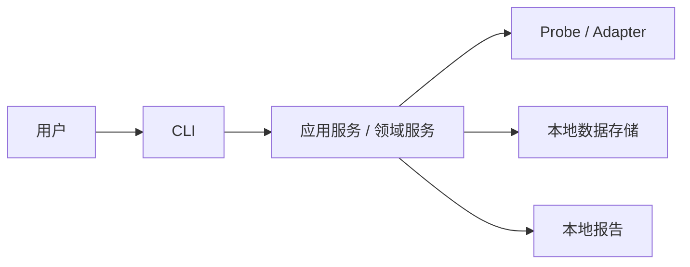
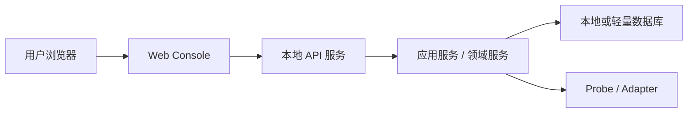
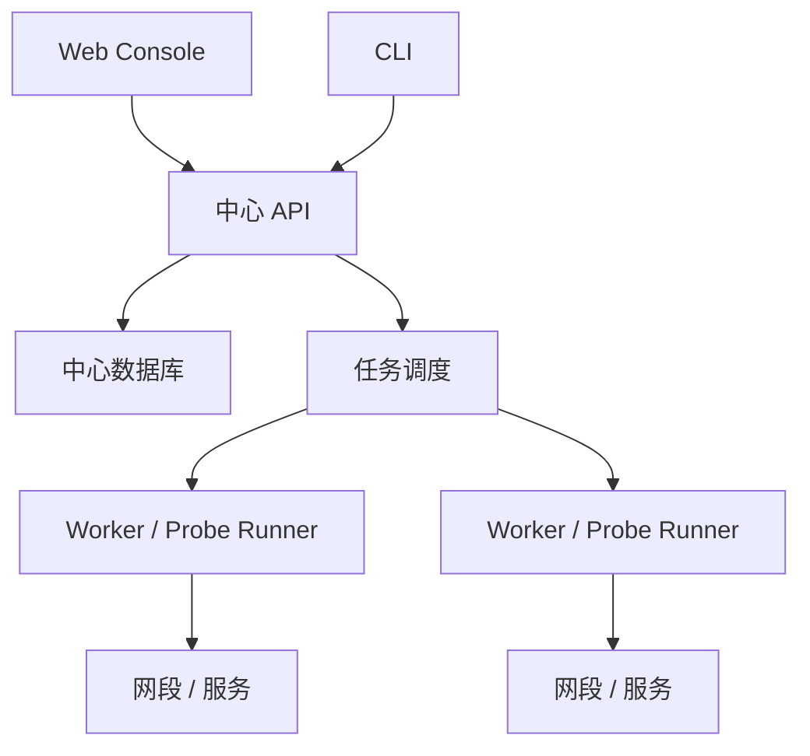
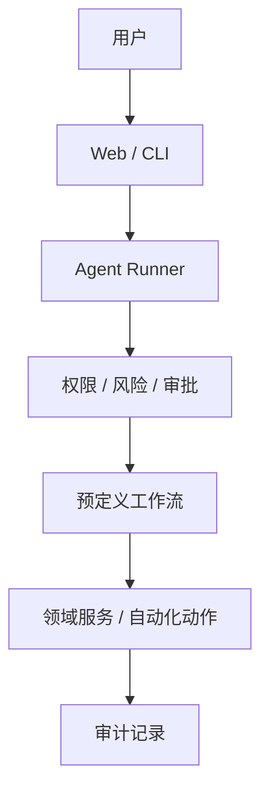

# 部署模型

## 文档目的

这份文档定义平台未来可能的运行形态。

虽然第一阶段只做 CLI，但必须提前区分本地 CLI、本地 Web、中心服务、Worker、Agent 的关系。

## 模式一：单机 CLI 模式

这是第一阶段目标。

特点：

- 部署简单。
- 适合桌面运维和现场排障。
- 不需要服务器。
- 数据保存在本地。

适用场景：

- 单人使用。
- 临时巡检。
- 故障现场诊断。
- 小范围资产扫描。

## 模式二：本地 Web Console 模式

未来第二阶段或第三阶段可以进入。

特点：

- 有图形界面。
- 可以查看资产、任务、结果和报告。
- 仍然可以单机运行。
- 适合小团队共享一台管理机。

适用场景：

- 小型 IT 团队。
- 固定运维电脑。
- 日常巡检看板。

## 模式三：中心服务 + Worker 模式

长期方向。

特点：

- 支持定时任务。
- 支持集中数据。
- 支持多用户。
- 支持多个 Worker。

适用场景：

- 有固定 IT 管理服务器。
- 多网段巡检。
- 多人查看结果。
- 需要长期历史数据。

## 模式四：受控 Agent 模式

长期方向，只在权限和审批成熟后进入。

特点：

- Agent 只能调用已批准能力。
- 高风险动作需要审批。
- 每一步有审计记录。
- 可中断、可人工接管。

## 第一阶段部署要求

第一阶段只需要支持单机 CLI 模式。

但代码结构要避免：

- 把数据路径写死。
- 把 CLI 和业务逻辑绑死。
- 把本地存储直接暴露给 CLI。
- 让报告依赖 CLI 输出文本。

## 后续演进原则

- Web 是新入口，不是新系统。
- API 调用已有服务。
- Worker 调用已有 Probe / Adapter。
- Agent 调用已有工作流和自动化动作。
- 数据模型尽量保持稳定。

